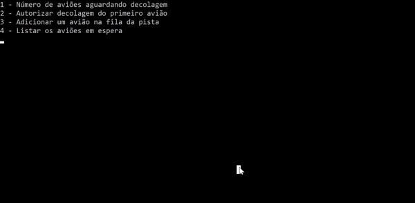

# Fila Estrutura De Dados
Exercício realizado durante disciplina de estrutura de dados na faculdade para compreensão da estrutura de fila. Através da alusão a um aeroporto, onde os aviões se encontram em uma fila,  aguardando liberação da pista e decolando com gráficos animados feitos com matriz de caracteres. Obs: O programa se encontra com seu código original, não foi realizado refatoração. Sendo seu código-fonte datado de ‎19‎/08/‎2019, período onde estava aprendendo programação com C, no segundo semestre da faculdade. 

Fila de aviões na pista de decolagem:

